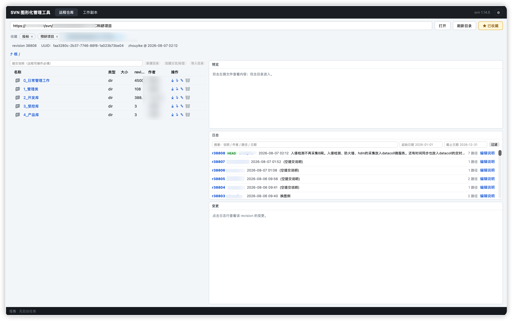
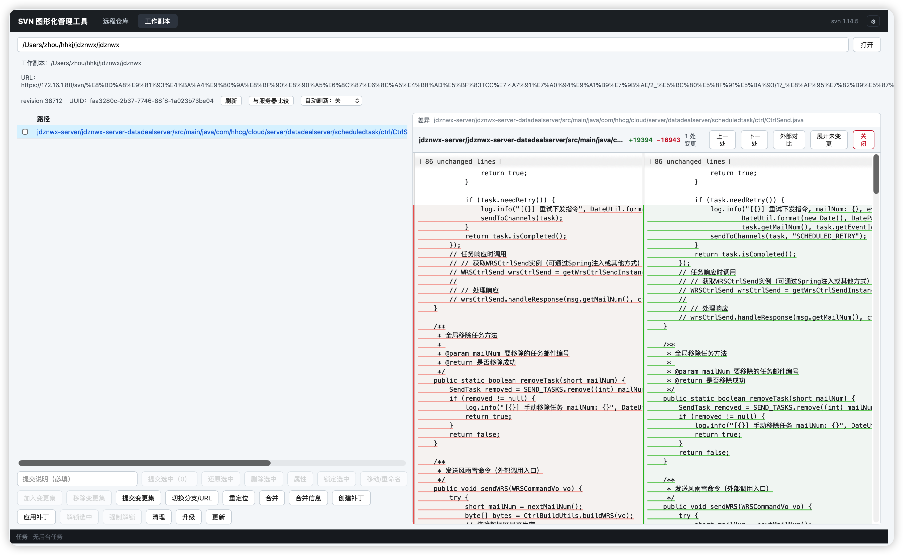

# Tortoise_svn_mac

macOS 上的 SVN 图形化管理工具（类 TortoiseSVN）。基于 **Tauri 2 + Rust + Vue 3 + TypeScript**，封装系统 `svn` 命令行（XML 输出），提供远程仓库浏览、工作副本管理、Diff/三方合并、后台任务等完整闭环能力。

> 需要本机安装 Subversion 1.14+（如 `brew install subversion`，二进制默认从 `/opt/homebrew/bin/svn` 或 PATH 发现，可在应用「设置」中手动指定）。

## 📸 界面预览




## ✨ 功能特性

### 远程仓库
- 链接远程仓库（HTTP/HTTPS/SVN/file 协议），目录树浏览、文件预览/下载
- 检出到本地（支持稀疏深度与指定 revision 的后台任务）
- 远程写操作：新建目录 / 删除 / 复制（分支·标签）/ 移动 / 导入 / 导出
- 仓库标准布局探测（trunk/branches/tags）一键切换，创建分支/标签对话框
- 日志查看：revision 过滤、作者/日期/关键词搜索、revision 一键复制、HEAD 标记
- 收藏夹 + 访问历史下拉记录（自动记住最近访问的仓库）

### 工作副本
- 状态查看（本地/远程对比 `status -u`）、逐文件 Diff（并排视图，语法高亮 + 变更块跳转 + 外部工具对比）
- 提交（可勾选部分文件，提交确认清单）、更新（后台任务不卡 UI）、cleanup / resolve / upgrade
- 分支切换（switch）、重定位（relocate）、合并（merge，支持 mergeinfo 已合入/可合入查看）
- 属性管理（proplist / propset svn:ignore 批量）、锁定/解锁、changelist 变更集分组提交
- Blame 逐行归属、补丁创建与应用、导入（目录体检提示）、移动/重命名、编辑提交说明
- 冲突三方合并编辑器（逐块选择 mine/base/theirs，自动写回并 resolve）
- 文件变更自动刷新（文件系统监听，防抖刷新，也可手动 15/30/60s 轮询）

### 通用
- 后台任务管理：长任务（检出/更新/导入/导出/提交）异步执行 + 底部任务栏进度/取消/失败详情
- 认证：用户名/密码弹窗重试（密码仅走 stdin）、证书临时接受 / 永久信任站点列表、凭据查看与清理（`svn auth`）
- 大目录/大日志虚拟列表（万级条目流畅滚动）
- 深色友好 UI，全部中文界面

## 🛠 技术栈

| 层 | 技术 |
|---|---|
| 桌面框架 | Tauri 2（macOS） |
| 后端 | Rust（svn CLI 封装、XML 解析、全局写锁、后台任务、文件监听 notify） |
| 前端 | Vue 3 + TypeScript + Vite |
| Diff | CodeMirror 6 merge（并排视图、语法高亮）；大文件走 Rust `similar` 预计算 chunks |
| 测试 | Rust 集成测试（真实 svn/svnadmin 临时仓库闭环）+ vue-tsc + 构建 |

## 🚀 开发运行

```bash
# 依赖：Node 22+、Rust 1.97+、Subversion 1.14+
npm install

# 开发（自动构建 Rust 并启动，前端端口 1421）
./manage.sh start
./manage.sh status   # 查看运行状态
./manage.sh logs     # 查看日志
./manage.sh stop     # 停止

# 验证与构建
npm run typecheck    # 前端类型检查
npm run build        # 前端产物
./manage.sh test     # Rust 单元 + 集成测试（真实 svn 仓库闭环）
./manage.sh build    # 发布构建
```

> 📦 **CI 与发布流水线**（GitHub Actions）：详见 [docs/CI.md](docs/CI.md) —— 每次 push/PR 自动测试，打 `v*` tag 自动构建 Universal DMG 并发布 Release。
>
> 🚀 **发布操作手册**：详见 [docs/RELEASE.md](docs/RELEASE.md) —— 发布新版本的完整操作步骤（token 配置 / 打 tag / 确认草稿 / 常见问题）。

## 📁 目录结构

```
src/                    # Vue 3 前端
src-tauri/              # Rust 后端
  src/svn/              # svn 命令封装（runner/parser/models/commands/task/...）
  tests/svn_flow.rs     # 集成测试（真实仓库闭环）
scripts/                # 图标生成脚本（纯标准库 Python 手写 PNG）
功能待办.md             # 功能批次规划与状态
执行进度.md             # 开发里程碑记录
问题记录.md             # 问题与修复记录
SVN图形化管理工具开发计划.md  # 原始开发计划
```

## 📄 License

[MIT](LICENSE)
